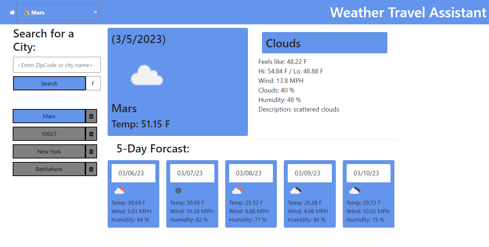

weather_travel_assistant
## Weather Travel Assistant

## Table of Contents
- [Description](#description)
- [Screenshot](#Screenshot)
- [User Story](#user-story)
- [Acceptance Criteria](#acceptance-criteria)
- [Links](#Links)
- [Questions](#questions)

## Decription

This is a javascript application that uses OpenWeatherApi to provide the user with both the current weather, and the forecast of the next five days. The results are obtained when the user inputs either a zipCode or a CityName into the input field and clicks submit. The application uses local storage to provide the user with a shortcut list of recent searches, which can also be individually deleted.

## Screenshot

## User Story

AS A traveler
I WANT to see the weather outlook for multiple cities
SO THAT I can plan a trip accordingly

## Acceptance Criteria

GIVEN a weather dashboard with form inputs
WHEN I search for a city
THEN I am presented with current and future conditions for that city and that city is added to the search history
WHEN I view current weather conditions for that city
THEN I am presented with the city name, the date, an icon representation of weather conditions, the temperature, the humidity, and the the wind speed
WHEN I view future weather conditions for that city
THEN I am presented with a 5-day forecast that displays the date, an icon representation of weather conditions, the temperature, the wind speed, and the humidity
WHEN I click on a city in the search history
THEN I am again presented with current and future conditions for that city

## Links

[Repository](https://github.com/Nathanpatnaude/weather_travel_assistant)

[LiveSite]()

## Questions
[Nathan Patnaude](mailto:Nathanpatnaude@gmail.com) , [GitHub Account](https://github.com/Nathanpatnaude) 
This Project is on [GitHub: weather_travel_assistant](https://github.com/Nathanpatnaude/weather_travel_assistant)
